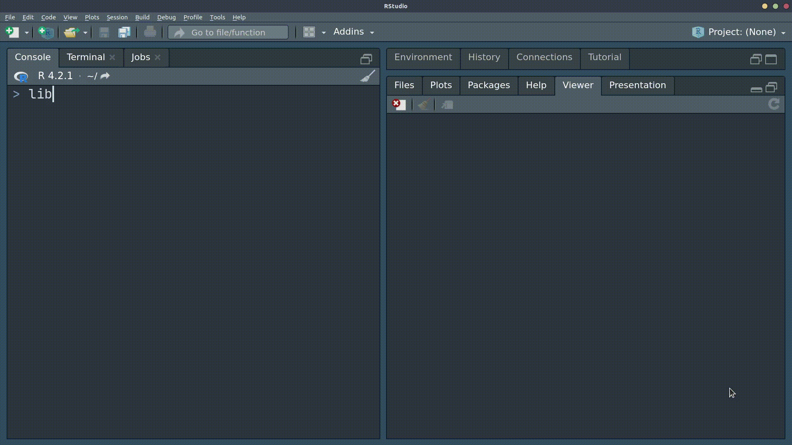

<!-- README.md is generated from README.Rmd. Please edit that file -->

# flashr <a href="https://jeffreyrstevens.github.io/flashr/"></a>

<!-- badges: start -->

[](https://lifecycle.r-lib.org/articles/stages.html#stable)
[](https://cran.r-project.org/package=flashr)
[](https://CRAN.R-project.org/package=flashr)

[](https://github.com/JeffreyRStevens/flashr/actions/workflows/R-CMD-check.yaml)
[](https://app.codecov.io/gh/JeffreyRStevens/flashr)
<!-- badges: end -->

Learning all of the functions needed to become proficient in R is a
substantial undertaking. Flashcards are a great way to learn the syntax
of computer languages (Hermans 2021). The goal of flashr (pronounced
“flash-r”) is to provide a quick way to view decks of flashcards.

flashr can use existing built-in flashcard decks hosted at the
[flashr_decks GitHub
repo](https://github.com/JeffreyRStevens/flashr_decks), including
functions and arguments from [R for Data Science, first
edition](https://r4ds.had.co.nz/) and glossaries from several [psyTeachR
books](https://psyteachr.github.io/). Check out some [example
decks](https://jeffreyrstevens.github.io/flashr_decks/decks.html).

In addition to built-in decks, you can easily create your own decks
using CSV files. This allows you to customize existing decks or create
completely new decks. Also, while geared toward learning R, this package
can be used to build decks for anything—not just computer syntax!

## Installation

You can install the stable released version of flashr from
[CRAN](https://cran.r-project.org/package=flashr) with:

``` r
install.packages("flashr")
```

You can install the development version of flashr like so:

``` r
# install.packages("remotes")
remotes::install_github("JeffreyRStevens/flashr")
```

## Example

To view, for example, the flashcard deck on data types:

``` r
library(flashr)
flashcard("data_types")
```

This randomizes the order of terms and give terms before descriptions.
If you would like to present descriptions before terms:

``` r
flashcard("data_types", termsfirst = FALSE)
```



## Building decks

To build your own deck, save a CSV file with a `term` column and a
`description` column. You can also include a `package` column if you
want the package name included with the term and a `title` column if you
want to specify the title of the deck.

``` r
my_deck <- read.csv("inst/extdata/operators.csv")
head(my_deck)
#>   term            description package     title
#> 1    =    assignment operator    base Operators
#> 2   <-    assignment operator    base          
#> 3   |> pipe operator (base R)    base          
#> 4    +               addition    base          
#> 5    -            subtraction    base          
#> 6    *         multiplication    base
```

Then run the `flashcard()` function on your file.

``` r
flashcard("inst/extdata/operators.csv")
```

Check out the [Get Started
vignette](https://jeffreyrstevens.github.io/flashr/articles/flashr.html#creating-your-own-decks)
for more details on creating your own flashcard deck.

## Citation

To cite flashr, use:

> Stevens, Jeffrey R. (2024). flashr: Creates flashcards of terms and
> definitions. (version 0.1.2)
> <https://cran.r-project.org/package=flashr>

## Contributing to this package

Contributions to flashr are most welcome! Feel free to check out [open
issues](https://github.com/JeffreyRStevens/flashr/issues) for ideas. And
[pull requests](https://github.com/JeffreyRStevens/flashr/pulls) are
encouraged, but you may want to [raise an
issue](https://github.com/JeffreyRStevens/flashr/issues) or [contact the
maintainer](mailto:jeffrey.r.stevens@protonmail.com) first.

## Acknowledgments

This work was funded by US National Science Foundation grant
NSF-1658837.

## References

Hermans, F. (2021). The Programmer’s Brain. Manning.
<https://www.manning.com/books/the-programmers-brain>
